# R-Zoo: CV Application Subset — Image-Driven Floorplan Outlines and DEF Mapping

A lightweight subset demonstrating DIEAREA generation from 2D outline images. The gallery below pairs each original outline with its generated floorplan and links to the corresponding DEF for inspection or reuse.

## Outline ↔ Generated Floorplan ↔ DEF

| Index | Original Outline | Generated Floorplan (click for DEF) |
|:----:|:----------------:|:-----------------------------------:|
| 1 | 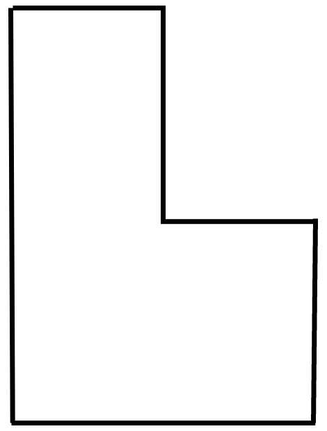 | [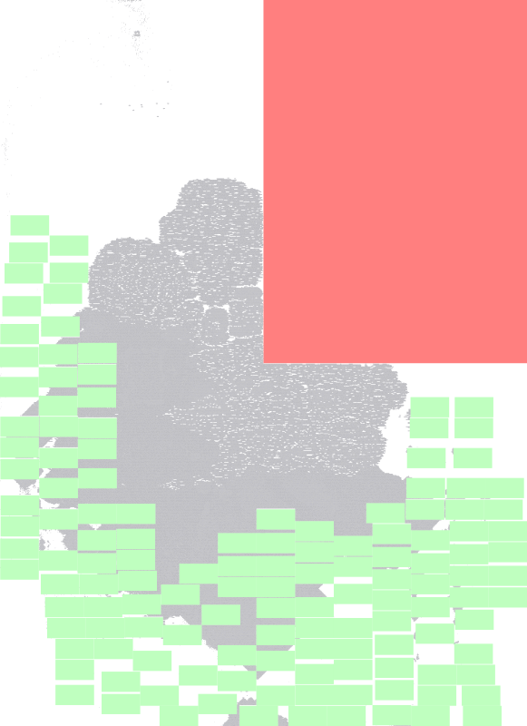](generated_defs_ariane136/generated_1.def) |
| 2 | 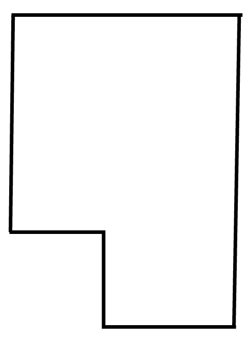 | [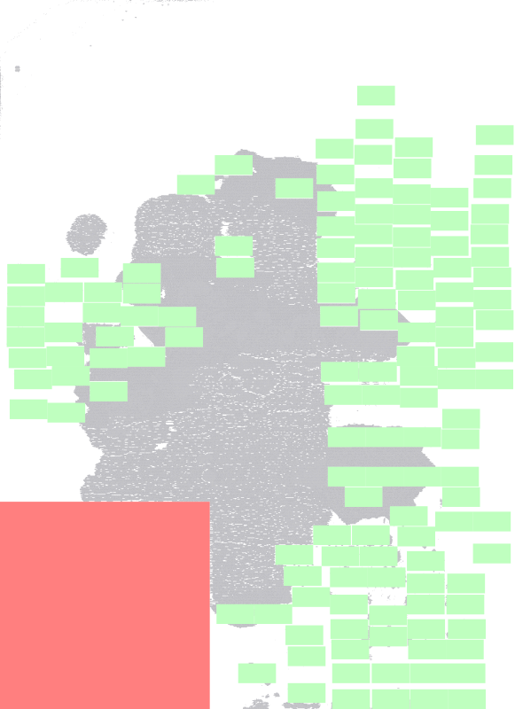](generated_defs_ariane136/generated_2.def) |
| 3 | 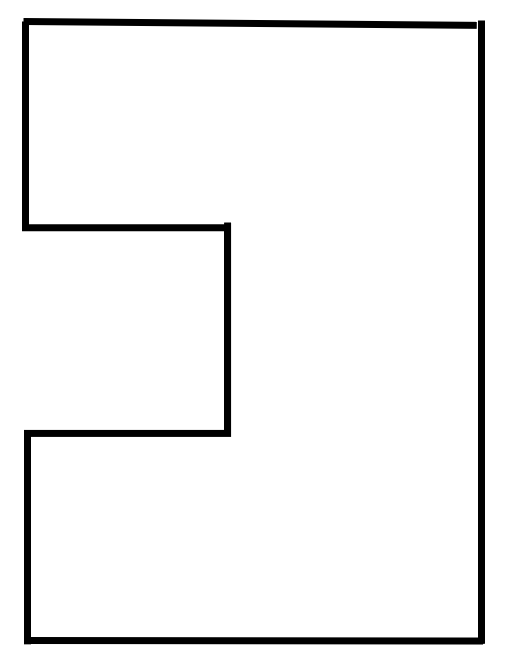 | [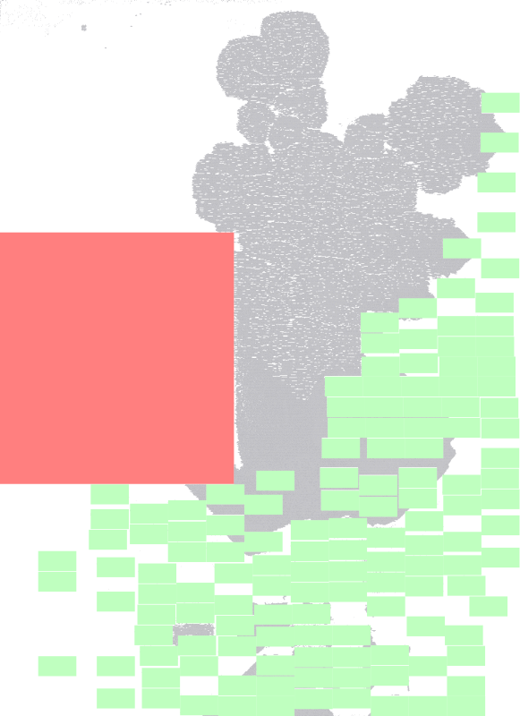](generated_defs_ariane136/generated_3.def) |
| 4 | 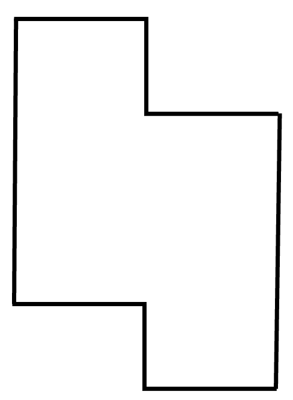 | [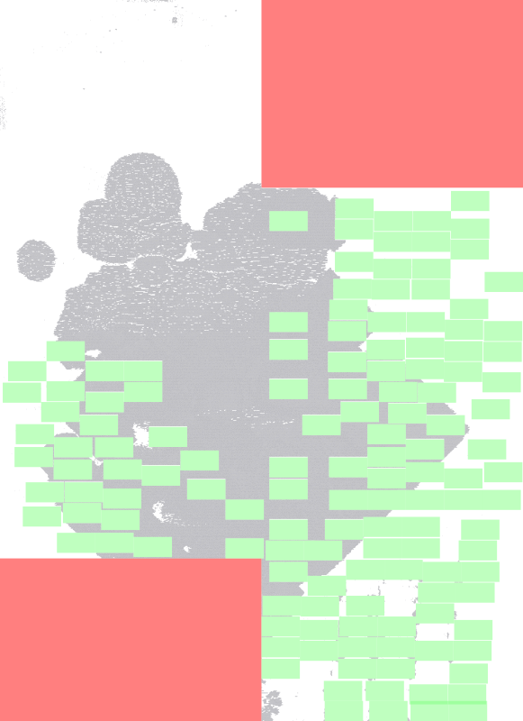](generated_defs_ariane136/generated_4.def) |
| 5 | 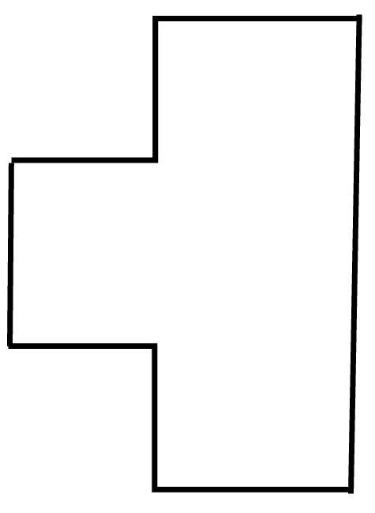 | [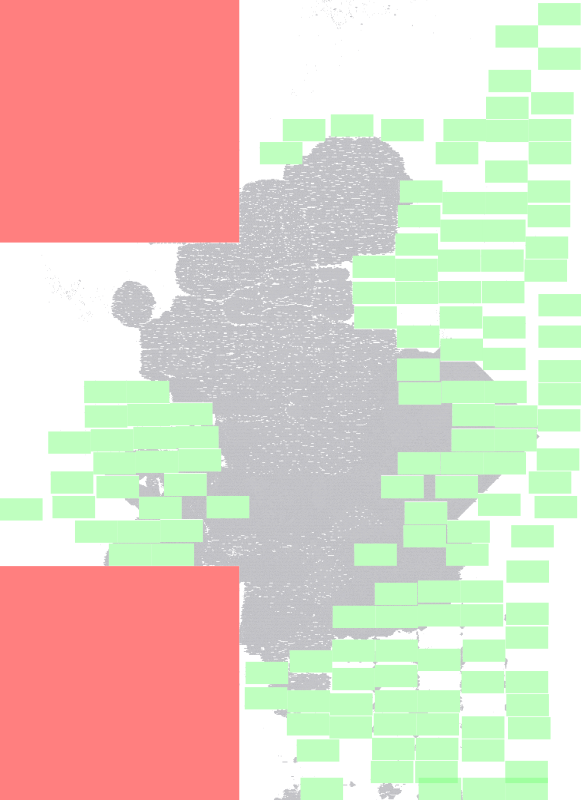](generated_defs_ariane136/generated_5.def) |
| 6 | 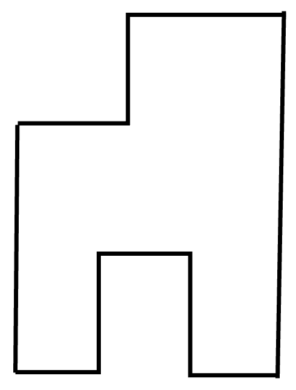 | [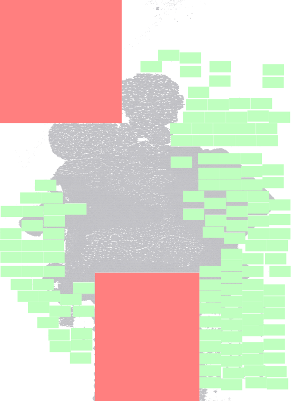](generated_defs_ariane136/generated_6.def) |
| 7 | 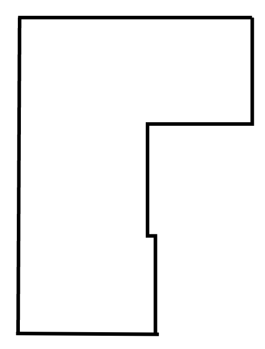 | [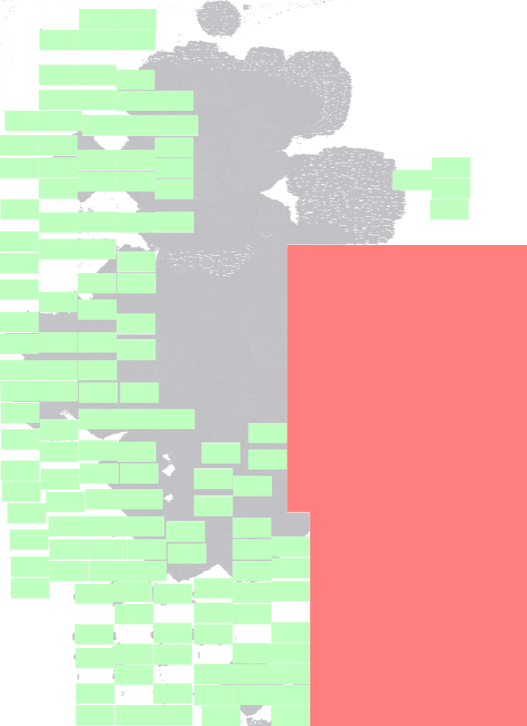](generated_defs_ariane136/generated_7.def) |
| 8 | 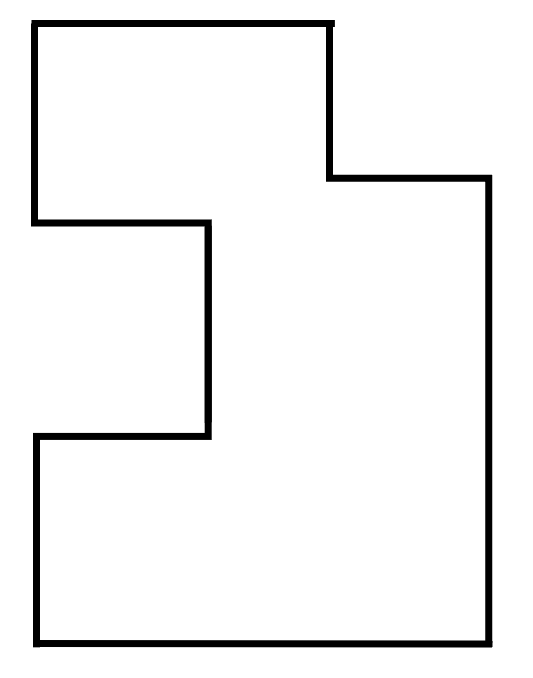 | [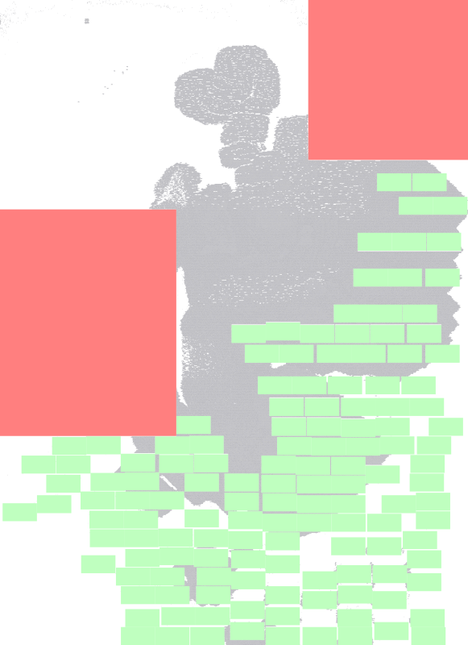](generated_defs_ariane136/generated_8.def) |
| 9 | 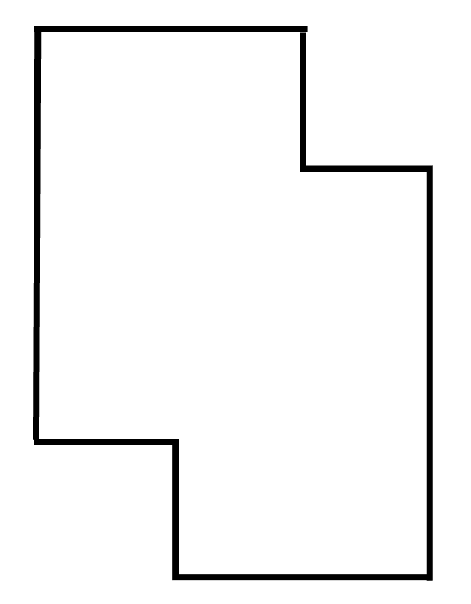 | [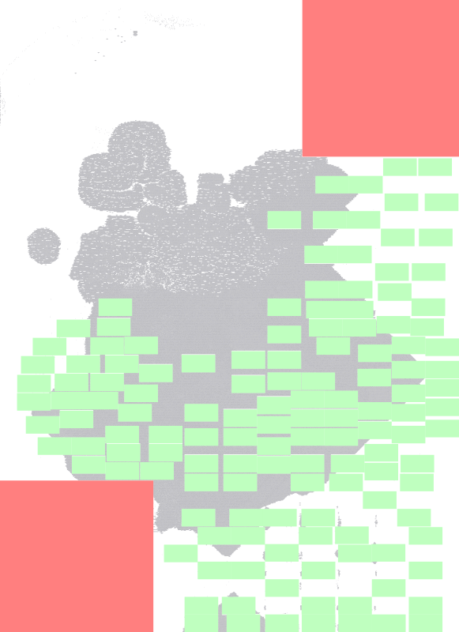](generated_defs_ariane136/generated_9.def) |
| 10 | 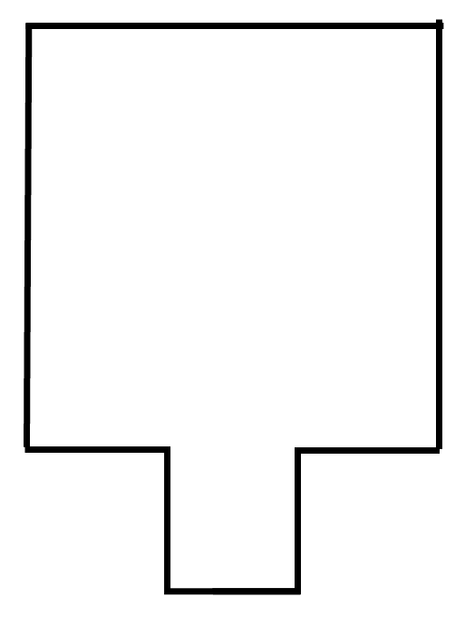 | [](generated_defs_ariane136/generated_10.def) |

> Convention: `generated_N.png` and `generated_N.def` share the same index; outlines follow `outline_N.png`.

---

## Repository layout

- `original_outlines/` – Raw outline PNG images (shape masks / silhouettes) serving as input.
- `generated_defs_ariane136/` – Output DEF floorplans for the Ariane136 design using image-derived DIEAREAs.
- `generated_floorplans_ariane136/` – Visualization PNGs corresponding to each generated DEF.

## Usage

DEFs are produced via the repository tool `scripts/modify_def.py` using the image generation mode `--generate-from-image`.

High-level steps:

1. Pick a target width and height in DBU (default UNITS often 2000 DBU/µm). Example: width = 6,000,000; height = 4,000,000.
2. Run the image conversion; the script extracts a polygon from the non-red region, normalizes orientation (clockwise), and emits a rectilinear DIEAREA.

Example (outline 1):

```bash
python3 ../../scripts/modify_def.py \
	-i ../../dataset/sample_ariane136/input_floorplan.def \
	-o generated_defs_ariane136/generated_1.def \
	--generate-from-image original_outlines/outline_1.png \
	--width 6000000 --height 4000000 --origin-at-zero --verbose
```

Batch (1–10):

```bash
for i in $(seq 1 10); do
	python3 ../../scripts/modify_def.py \
		-i ../../dataset/sample_ariane136/input_floorplan.def \
		-o generated_defs_ariane136/generated_${i}.def \
		--generate-from-image original_outlines/outline_${i}.png \
		--width 6000000 --height 4000000 --origin-at-zero;
done
```

Notes:

- `--width/--height` – Target DIEAREA bounding box dimensions (same unit as input DEF).
- `--origin-at-zero` – Translates polygon so min x/y become (0,0) for cleaner coordinates.
- `--verbose` – Prints extraction and polygon processing details.

Tip: Adjust width/height for alternative aspect ratios; confirm DBU per micron if not 2000. Convert µm × DBU/µm when designing new shapes.

## Visualization

`generated_floorplans_ariane136/*.png` act as quick-look previews of the DIEAREA geometry and internal rectilinear notches. To regenerate visuals, parse the DEF `DIEAREA` polyline and plot with a simple Python script (matplotlib or OpenCV), or feed into existing EDA visualization flows.

## Extending

- Switch design: change `-i` to another base rectangular DEF (e.g. `dataset/sample_*/input_floorplan.def`).
- New outlines: drop additional PNGs into `original_outlines/` and rerun the loop.
- Composite shapes: pre-combine masks before conversion for multi-notch experimentation.

## License

This subset follows the repository’s MIT License (see LICENSE if present).

## Acknowledgements

Image-driven conversion leverages the main tool `scripts/modify_def.py`. Inspirations include OpenROAD and MacroPlacement by TILOS-AI-Institute.

