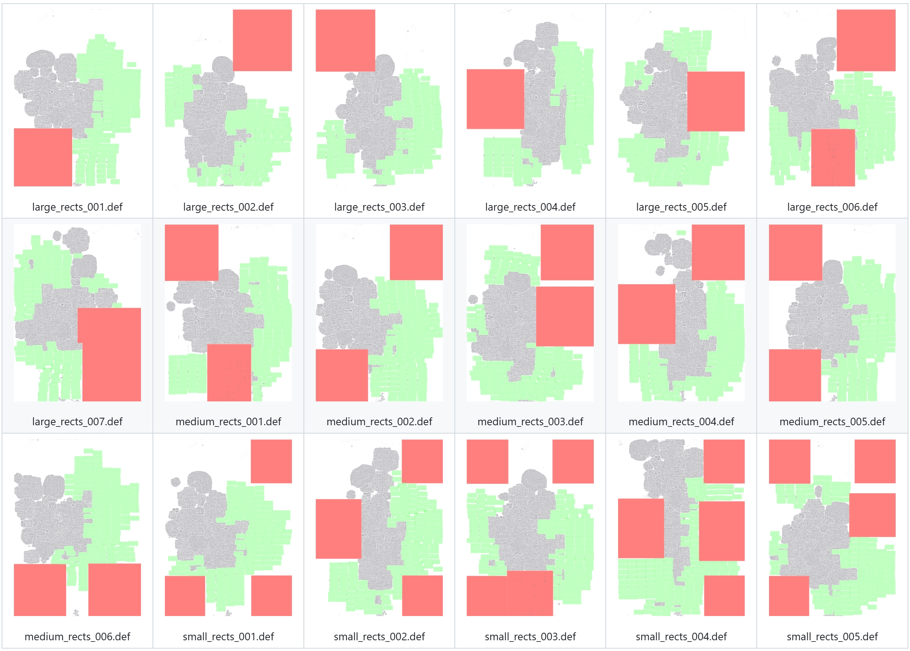
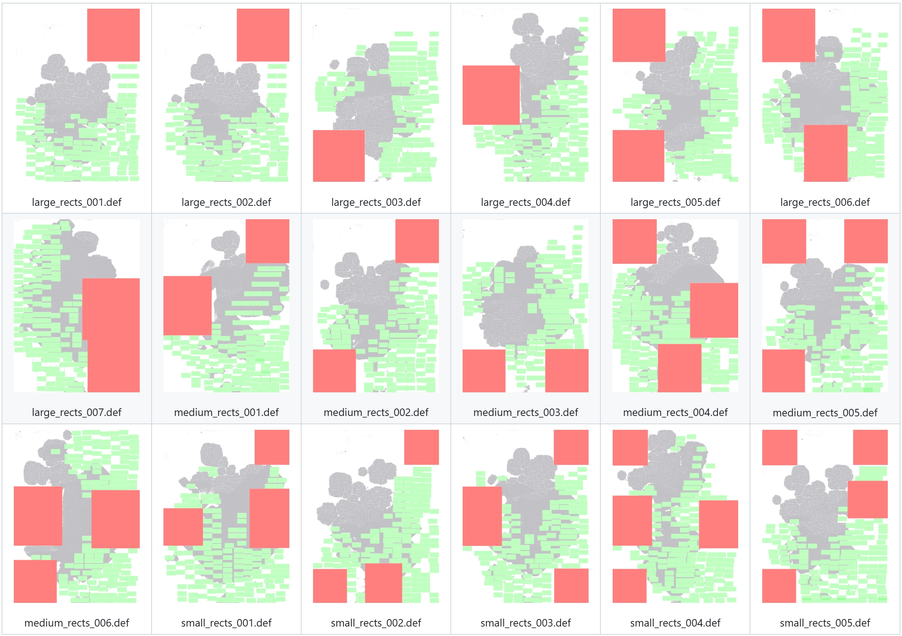
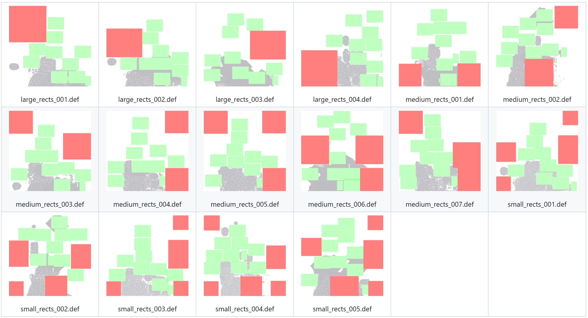
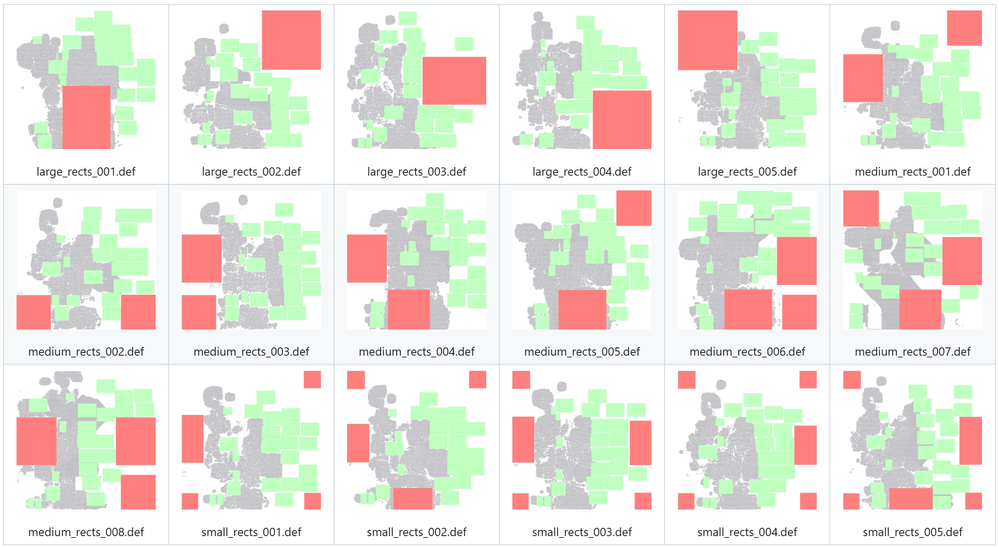
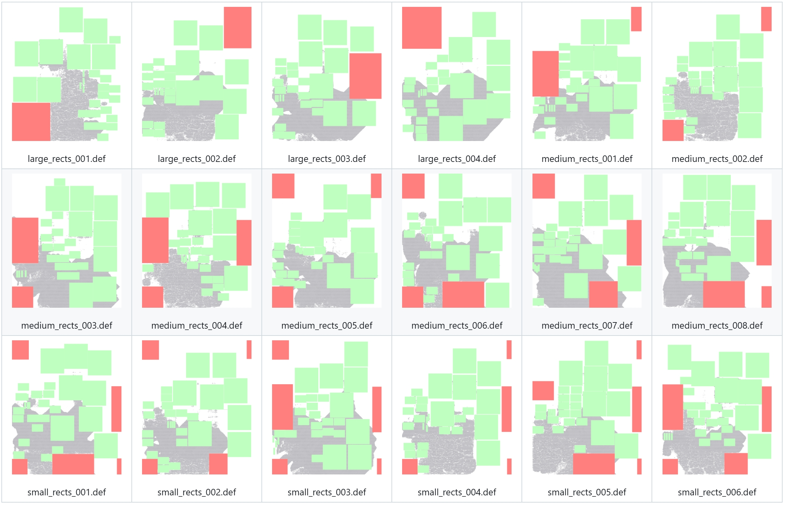

# R-Zoo: A Rectilinear Floorplan Benchmark Dataset for EDA Physical Design Research

A lightweight benchmark and toolset for generating and modifying DEF files (`.def`), focusing on the variety of rectilinear DIEAREA creation and transformation for large-scale chips. It also provides sample scripts to batch-generate benchmarks featuring multiple rectangular notches/holes.

## Benchmark Overview

| Design name | Design gallery (click to open corresponding folder) | Source files for floorplanning | DEF amounts | Legality rate |
|:---:|---|---|:---:|
| Ariane133 | [](benchmark/sample_ariane133/) | [Nangate45.lef](benchmark/sample_ariane133/input_sources/Nangate45.lef)<br>[Nangate45_tech.lef](benchmark/sample_ariane133/input_sources/Nangate45_tech.lef)<br>[Ng45_ariane133.v](benchmark/sample_ariane133/input_sources/Ng45_ariane133.v)<br>[fake_macros.lef](benchmark/sample_ariane133/input_sources/fake_macros.lef)<br>[fakeram45_256x16.lef](benchmark/sample_ariane133/input_sources/fakeram45_256x16.lef) | 18 |
| Ariane136 | [](benchmark/sample_ariane136/) | [Nangate45.lef](benchmark/sample_ariane136/input_sources/Nangate45.lef)<br>[Nangate45_tech.lef](benchmark/sample_ariane136/input_sources/Nangate45_tech.lef)<br>[Ng45_ariane136.v](benchmark/sample_ariane136/input_sources/Ng45_ariane136.v)<br>[fake_macros.lef](benchmark/sample_ariane136/input_sources/fake_macros.lef)<br>[fakeram45_256x16.lef](benchmark/sample_ariane136/input_sources/fakeram45_256x16.lef) | 18 |
| BlackParrot — Back End (BP BE) | [](benchmark/sample_bp_be/) | [Nangate45.lef](benchmark/sample_bp_be/input_sources/Nangate45.lef)<br>[Nangate45_tech.lef](benchmark/sample_bp_be/input_sources/Nangate45_tech.lef)<br>[Ng45_bp_be.v](benchmark/sample_bp_be/input_sources/Ng45_bp_be.v)<br>[fake_macros.lef](benchmark/sample_bp_be/input_sources/fake_macros.lef)<br>[fakeram45_512x64.lef](benchmark/sample_bp_be/input_sources/fakeram45_512x64.lef)<br>[fakeram45_64x15.lef](benchmark/sample_bp_be/input_sources/fakeram45_64x15.lef)<br>[fakeram45_64x96.lef](benchmark/sample_bp_be/input_sources/fakeram45_64x96.lef) | 18 |
| BlackParrot — Front End (BP FE) | [](benchmark/sample_bp_fe/) | [Nangate45.lef](benchmark/sample_bp_fe/input_sources/Nangate45.lef)<br>[Nangate45_tech.lef](benchmark/sample_bp_fe/input_sources/Nangate45_tech.lef)<br>[Ng45_bp_fe.v](benchmark/sample_bp_fe/input_sources/Ng45_bp_fe.v)<br>[fake_macros.lef](benchmark/sample_bp_fe/input_sources/fake_macros.lef)<br>[fakeram45_512x64.lef](benchmark/sample_bp_fe/input_sources/fakeram45_512x64.lef)<br>[fakeram45_64x7.lef](benchmark/sample_bp_fe/input_sources/fakeram45_64x7.lef)<br>[fakeram45_64x96.lef](benchmark/sample_bp_fe/input_sources/fakeram45_64x96.lef) | 16 |
| BlackParrot — Multi-core (BP Multi) | [](benchmark/sample_bp_multi/) | [Nangate45.lef](benchmark/sample_bp_multi/input_sources/Nangate45.lef)<br>[Nangate45_tech.lef](benchmark/sample_bp_multi/input_sources/Nangate45_tech.lef)<br>[Ng45_bp_multi.v](benchmark/sample_bp_multi/input_sources/Ng45_bp_multi.v)<br>[fake_macros.lef](benchmark/sample_bp_multi/input_sources/fake_macros.lef)<br>[fakeram45_256x96.lef](benchmark/sample_bp_multi/input_sources/fakeram45_256x96.lef)<br>[fakeram45_32x64.lef](benchmark/sample_bp_multi/input_sources/fakeram45_32x64.lef)<br>[fakeram45_512x64.lef](benchmark/sample_bp_multi/input_sources/fakeram45_512x64.lef)<br>[fakeram45_64x15.lef](benchmark/sample_bp_multi/input_sources/fakeram45_64x15.lef)<br>[fakeram45_64x7.lef](benchmark/sample_bp_multi/input_sources/fakeram45_64x7.lef)<br>[fakeram45_64x96.lef](benchmark/sample_bp_multi/input_sources/fakeram45_64x96.lef) | 18 |
| SwervWrapper (SW) | [](benchmark/sample_sw/) | [Nangate45.lef](benchmark/sample_sw/input_sources/Nangate45.lef)<br>[Nangate45_tech.lef](benchmark/sample_sw/input_sources/Nangate45_tech.lef)<br>[Ng45_sw.v](benchmark/sample_sw/input_sources/Ng45_sw.v)<br>[fake_macros.lef](benchmark/sample_sw/input_sources/fake_macros.lef)<br>[fakeram45_2048x39.lef](benchmark/sample_sw/input_sources/fakeram45_2048x39.lef)<br>[fakeram45_256x34.lef](benchmark/sample_sw/input_sources/fakeram45_256x34.lef)<br>[fakeram45_64x21.lef](benchmark/sample_sw/input_sources/fakeram45_64x21.lef) | 18 |
| RocketTile (TR) | [](benchmark/sample_tr/) | [Nangate45.lef](benchmark/sample_tr/input_sources/Nangate45.lef)<br>[Nangate45_tech.lef](benchmark/sample_tr/input_sources/Nangate45_tech.lef)<br>[Ng45_tr.v](benchmark/sample_tr/input_sources/Ng45_tr.v)<br>[fake_macros.lef](benchmark/sample_tr/input_sources/fake_macros.lef)<br>[fakeram45_1024x32.lef](benchmark/sample_tr/input_sources/fakeram45_1024x32.lef)<br>[fakeram45_64x32.lef](benchmark/sample_tr/input_sources/fakeram45_64x32.lef) | 15 |


## Repository layout

The detailed layout of the repository is listed as follows:

```graphql
├── benchmark/                 # Benchmark floorplans for seven designs
│   └── sample_design/         # Individual design folder with DEF files, plots, inputs, and scripts
│       ├── def_files/         # Batch of DEF files, ordered by size and number of cutouts (.def)
│       ├── floorplan_plots/   # DREAMPlace floorplan visualizations matching DEF files (.png)
│       ├── input_sources/     # Verilog and LEF input files used for synthesis (.v, .lef)
│       ├── input_floorplan.def  # Input rectangular DEF for the modifier (.def)
│       ├── design_modifier.sh   # Bash script for benchmark production (.sh)
│       └── README.md            # Visual gallery linking images to corresponding DEF files (.md)
│
├── script/                    # Scripts for floorplan generation and modification
│   ├── generate_def.py        # Generates rectangular floorplans from scratch (.py)
│   ├── default_config.json    # Default configuration parameters for generate_def.py (.json)
│   ├── modify_def.py          # Converts rectangular floorplans into rectilinear ones (.py)
│   ├── default_modifier.sh    # Batch script for rectilinear floorplan production (.sh)
│   └── rng_helper.py          # RNG utility supporting random generation logic (.py)
│
├── gallery/                   # Visualization collection for all generated floorplans
│
└── README.md                  # Repository overview and usage instructions (.md)
```

## Getting Started

### Requirements
- Python 3.8+ (Python 3.x works; 3.8+ recommended)
- Unix-like shell (Linux/macOS/WSL) with bash, awk, sed
- Optional: Git (for version control)
- Optional: OpenCV for image-driven DIEAREA generation only (`--generate-from-image`). You can install via pip or your package manager.
    - pip: `pip install opencv-python`
    - Ubuntu/Debian: `sudo apt-get install python3-opencv`

### Clone
```bash
git clone https://github.com/iCAS-SJTU/Chip-Like-A-House
cd Chip-Like-A-House
```


## Usage
### 1) Generate a basic `.def` (script/generate_def.py)

Given DIE width/height in DBU, the generator produces:
- Reasonable margins (max of percentage-based and engineering minimums)
- Alternating ROW orientations (N/FS)
- TRACKS for metal1…metal10 (with optional per-layer +1 adjustment)

Run from repo root:
```bash
python3 script/generate_def.py -w <width_dbu> -t <height_dbu> -o <output.def> -d <design_name>
```

With a configuration file:
```bash
python3 script/generate_def.py -w <width_dbu> -t <height_dbu> -o <output.def> -c script/default_config.json
```

Save the current defaults as a template:
```bash
python3 script/generate_def.py --save-config script/default_config.json
```

Notes:
- Units: DBU per micron is set by the UNITS line in the generated DEF (default 2000 DBU/µm). Convert microns to DBU as needed.
- Validation: if the die is too small to fit at least one standard cell-wide ROW, the tool errors and prints the minimum required size.

### 2) Modify DIEAREA (script/modify_def.py)

Two primary modes are supported.

#### A. Rectangular cutouts (carving holes)
```bash
python3 script/modify_def.py \
    -i <input.def> -o <output.def> \
    -r <num_rects> -c <x1 y1 x2 y2 ...> [--verbose]
```
- For each rectangle, provide exactly two points (4 integers per rectangle):
    - One point on the boundary (edge or corner)
    - One point strictly inside the die
- The tool automatically identifies which is the edge vs internal point and emits axis-aligned cutouts. Multiple non-overlapping cutouts are supported.

Example (two notches):
```bash
python3 script/modify_def.py -i in.def -o out.def -r 2 -c 0 200000 150000 500000  800000 0 600000 300000
```

#### B. Replace the DIEAREA polyline directly
```bash
python3 script/modify_def.py \
    -i <input.def> -o <output.def> \
    --diearea-line "DIEAREA ( x0 y0 ) ( x1 y1 ) ... ( xN yN ) ;" [--verbose]
```
- Replaces the original DIEAREA line as-is.

#### C. Generate DIEAREA from an image (optional, requires OpenCV)
```bash
python3 script/modify_def.py \
    -i <input.def> -o <output.def> \
    --generate-from-image <path/to/image.png> \
    --width <target_width> --height <target_height> [--origin-at-zero] [--verbose]
```
- The outline is extracted from the non-red region of the image and converted to a clockwise polygon.
- width/height are target DIEAREA dimensions in the same unit as your DEF (typically DBU). If your DEF uses 2000 DBU/µm and you want 3000 µm wide, pass 6,000,000.
- Use `--origin-at-zero` to translate the polygon so the minimum x/y becomes (0,0).

### 3) Batch generation options

You have two convenient ways to produce many rectilinear variants.

#### Option A: Generic batch script (script/default_modifier.sh)
Edit a few variables at the top of `script/default_modifier.sh` and run it:
- PY_SCRIPT: path to the Python tool (`script/modify_def.py` by default)
- INPUT_DEF: path to the input DEF you want to modify
- OUT_DIR: output directory (created if missing)
- OUTPUT_PREFIX: filename prefix (e.g., `small_rects` -> `small_rects_001.def`)
- NUM_VARIANTS: number of variants (can also be provided as the first CLI arg)
- MIN_RECTS/MAX_RECTS, MIN_DEPTH/MAX_DEPTH, MAX_TRIES_PER_RECT, DEBUG, ASPECT_CENTER

Minimal example to get 20 output floorplans (from repo root):
```bash
bash script/default_modifier.sh 20
```
Outputs go to `$OUT_DIR/` and errors (if any) to `$OUT_DIR/err_NNN.log`.

#### Option B: Per-design helper scripts (benchmark/sample_*/)
Each sample design ships a tailored modifier script, e.g.:
- `benchmark/sample_ariane133/ariane133_modifier.sh`
- `benchmark/sample_ariane136/ariane136_modifier.sh`
- `benchmark/sample_bp_be/bp_be_modifier.sh`, etc.

Run them from inside the sample directory and point `PY_SCRIPT` to the repo tool:
```bash
cd benchmark/sample_ariane133
PY_SCRIPT=../../script/modify_def.py bash ariane133_modifier.sh 15
```
Outputs appear under the script’s configured `OUT_DIR` (e.g., `ariane133_small_rects/`).

Tip: Pre-generated datasets are already included under `benchmark/sample_*/def_files/`. You can regenerate to a new folder and compare.

### 4) Troubleshooting
- OpenCV import error: Install OpenCV (see Requirements). Image mode is optional; other modes don’t require it.
- “DIEAREA line not found”: Ensure your input DEF contains a valid `DIEAREA ... ;` line.
- “Coordinate count must be ...”: For `-r N`, you must pass exactly `4*N` integers after `-c`.
- “One point must be inside and one on the edge”: Recheck each rectangle’s pair semantics.
- Units mismatch: Keep all coordinates in the same unit as the DEF (DBU). Convert from microns using your DBU/µm.
- Permission denied when running `.sh`: `chmod +x script/*.sh benchmark/sample_*/**/*.sh`.

## License

This repository is released under the MIT License (see LICENSE if present).

## Acknowledgements

Examples are inspired by OpenROAD and MacroPlacement by TILOS-AI-Institute.
