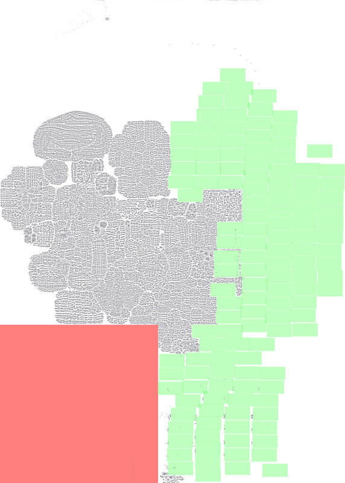
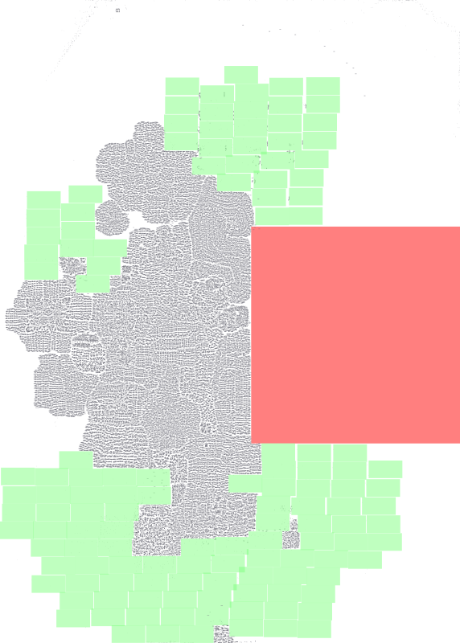
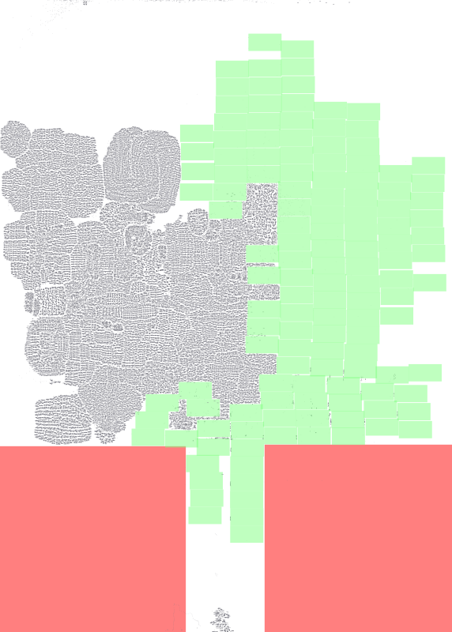
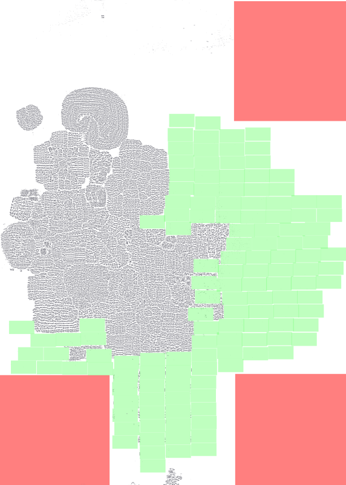

## Floorplan plots and corresponding .def files

Below is a visual gallery of the generated floorplans. Click any image to open the corresponding `.def` file in the `def_files/` folder.

<table>
	<tbody>
		<tr>
			<td align="center">
				 
				large_rects_001.def
			</td>
			<td align="center">
				 
				large_rects_002.def
			</td>
			<td align="center">
				 
				large_rects_003.def
			</td>
			<td align="center">
				 
				large_rects_004.def
			</td>
			<td align="center">
				 
				large_rects_005.def
			</td>
			<td align="center">
				 
				large_rects_006.def
			</td>
		</tr>
		<tr>
			<td align="center">
				 
				large_rects_007.def
			</td>
			<td align="center">
				 
				medium_rects_001.def
			</td>
			<td align="center">
				 
				medium_rects_002.def
			</td>
			<td align="center">
				 
				medium_rects_003.def
			</td>
			<td align="center">
				 
				medium_rects_004.def
			</td>
			<td align="center">
				 
				medium_rects_005.def
			</td>
		</tr>
		<tr>
			<td align="center">
				 
				medium_rects_006.def
			</td>
			<td align="center">
				 
				small_rects_001.def
			</td>
			<td align="center">
				 
				small_rects_002.def
			</td>
			<td align="center">
				 
				small_rects_003.def
			</td>
			<td align="center">
				 
				small_rects_004.def
			</td>
			<td align="center">
				 
				small_rects_005.def
			</td>
		</tr>
	</tbody>
</table>